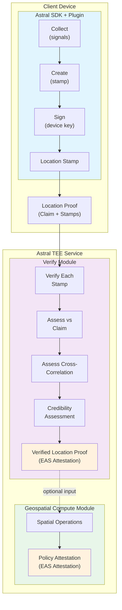

# Astral Location Verification - Technical Specification

**Version:** 0.1.0 (Draft)
**Status:** Design Phase
**Last Updated:** 2025-02-04

---

## Table of Contents

1. [Overview](#overview)
2. [Conceptual Framework](#conceptual-framework)
3. [Architecture](#architecture)
4. [Data Models](#data-models)
5. [Plugin System](#plugin-system)
6. [Verification Flow](#verification-flow)
7. [SDK Design](#sdk-design)
8. [API Design](#api-design)
9. [EAS Schemas](#eas-schemas)
10. [Security Considerations](#security-considerations)
11. [Open Questions](#open-questions)
12. [Future Work](#future-work)

---

## Overview

### What This Is

The Astral Verification module provides **evidence-based verification of location claims**. The module consists of:

1. **Client SDK** — Collects location evidence on devices (mobile, server, IoT), builds signed location stamps, and bundles them into location proofs
2. **Verify Service** — TEE-hosted endpoint that evaluates evidence and returns a credibility assessment
3. **Integration** — Verified location proofs can serve as trusted inputs to the Geospatial Compute module

### Core Value Proposition

**Location stamps are evidence. Location claims are assertions. Location proofs bundle evidence with claims. Verification evaluates how well evidence supports the claim.**

| Component | Input | Output |
|-----------|-------|--------|
| Client SDK | Raw signals (sensors, network, documents) | Signed location stamps |
| Verify Service | Location proof (claim + stamps) | Credibility assessment |

### Relationship to Geospatial Compute

Location Verification is **upstream** of Geospatial Compute:

| Location Verification | Geospatial Compute |
|----------------------|-------------------|
| Evaluates evidence credibility | Computes spatial relationships |
| Input: location proof (claim + stamps) | Input: locations (claimed or verified) |
| Output: credibility assessment | Output: policy attestation |
| "How confident are we that X was at L?" | "Is A inside B?" |

Location proofs that pass verification can serve as **verified inputs** to geospatial operations, increasing trust in the computed results.

---

## Conceptual Framework

Drawing from [Towards Stronger Location Proofs](https://collective.flashbots.net/t/towards-stronger-location-proofs/5323), we adopt a **composable evidence model**:

```
Raw Signals → Location Stamps → Location Proofs → Credibility Assessments
```

### Key Concepts

**Location Claim** — An assertion about the timing and location of an event. The event could be: a person's presence, a transaction's origin, an asset's location, a delivery, etc. Claims conform to the [Location Protocol](https://github.com/DecentralizedGeo/location-protocol-spec) specification.

**Location Stamp** — Evidence from a proof-of-location system that can corroborate a location claim. Stamps are **independent of claims** — they provide evidence about the timing and location of an event, which may come from:
- **Direct observation**: Sensor data, network measurements, hardware attestation
- **Indirect/derived sources**: Documents, records, institutional attestations

**Location Proof** — A stamp (or collection of stamps) bundled with a location claim. This is the verifiable artifact submitted for evaluation.

**Verification (Evidence Evaluation)** — The process of evaluating whether stamps support a claim across multiple dimensions. This produces a **credibility vector** with spatial, temporal, validity, and independence measurements. Applications weight these dimensions according to their own trust models.

### Uncertainty Model

Location proofs inherently involve uncertainty in both space and time. Verification asks: *Given this evidence, what is the probability that the claimed event occurred within the claimed spatiotemporal bounds?*

The tradeoff: **larger bounds = higher confidence, lower precision**. A claim of "somewhere in California during 2024" is easier to verify with high confidence but less useful. A claim of "within 10m at 14:32:07" is precise but harder to verify confidently.

Applications decide what precision/confidence balance they need. Broader claims may be valuable for privacy preservation.

### Forgery Resistance Principle

> **The cost of forging a location proof should exceed the economic value of the transaction it underpins.**

This is application-specific. A proof for a $10 check-in reward needs less forgery resistance than a proof for a $10M land title transfer. The credibility assessment helps applications make this determination.

---

## Architecture

### System Overview

```
┌─────────────────────────────────────────────────────────────────────────┐
│                              CLIENT DEVICE                              │
│                                                                         │
│  ┌───────────────────────────────────────────────────────────────────┐ │
│  │                      ASTRAL SDK + PLUGIN                          │ │
│  │  ┌─────────────┐   ┌─────────────┐   ┌─────────────┐             │ │
│  │  │   Collect   │ → │   Create    │ → │    Sign     │             │ │
│  │  │  (signals)  │   │  (stamp)    │   │ (device key)│             │ │
│  │  └─────────────┘   └─────────────┘   └─────────────┘             │ │
│  │        ↑                                     │                    │ │
│  │   Plugin A (ProofMode)                       │                    │ │
│  │   Plugin B (WitnessChain)                    │                    │ │
│  │   Plugin C (future...)                       ↓                    │ │
│  │                                    ┌─────────────────┐            │ │
│  │                                    │ Location Stamp  │            │ │
│  │                                    └────────┬────────┘            │ │
│  └─────────────────────────────────────────────┼─────────────────────┘ │
│                                                │                       │
│                            ┌───────────────────┴───────────────────┐   │
│                            │          Location Proof               │   │
│                            │   (Location Claim + Stamp(s))         │   │
│                            └───────────────────┬───────────────────┘   │
└────────────────────────────────────────────────┼───────────────────────┘
                                                 │
                                                 ↓
┌─────────────────────────────────────────────────────────────────────────┐
│                           ASTRAL TEE SERVICE                            │
│                                                                         │
│  ┌───────────────────────────────────────────────────────────────────┐ │
│  │                         VERIFY MODULE                             │ │
│  │  ┌──────────────┐   ┌──────────────┐   ┌────────────────────────┐│ │
│  │  │ Verify Each  │ → │ Assess vs    │ → │ Assess Cross-          ││ │
│  │  │    Stamp     │   │    Claim     │   │ Correlation            ││ │
│  │  └──────────────┘   └──────────────┘   └────────────────────────┘│ │
│  │         │                                          │              │ │
│  │         ↓                                          ↓              │ │
│  │  ┌─────────────────────────────────────────────────────────────┐ │ │
│  │  │              Credibility Assessment                         │ │ │
│  │  └─────────────────────────────────────────────────────────────┘ │ │
│  │                              │                                    │ │
│  │                              ↓                                    │ │
│  │  ┌─────────────────────────────────────────────────────────────┐ │ │
│  │  │            Verified Location Proof (EAS)                    │ │ │
│  │  └─────────────────────────────────────────────────────────────┘ │ │
│  └───────────────────────────────────────────────────────────────────┘ │
│                                                                         │
│  ┌───────────────────────────────────────────────────────────────────┐ │
│  │                     GEOSPATIAL COMPUTE MODULE                     │ │
│  │            (consumes verified or unverified locations)            │ │
│  │                              │                                    │ │
│  │                              ↓                                    │ │
│  │  ┌─────────────────────────────────────────────────────────────┐ │ │
│  │  │                Policy Attestation (EAS)                     │ │ │
│  │  └─────────────────────────────────────────────────────────────┘ │ │
│  └───────────────────────────────────────────────────────────────────┘ │
└─────────────────────────────────────────────────────────────────────────┘
```



### Key Architectural Decisions

1. **Proof = Claim + Stamp(s)** — A location proof bundles evidence (stamps) with an assertion (claim). This is the verifiable artifact.

2. **Three-phase verification** — (1) Verify each stamp independently, (2) Assess stamps against the claim, (3) Assess cross-correlation between stamps.

3. **Unified plugin interface** — One interface defines the full lifecycle (`collect`, `create`, `sign`, `verify`). Implementations vary by environment, but the contract is consistent.

4. **Distinct outputs** — Verify module outputs Verified Location Proofs. Compute module outputs Policy Attestations. These are different attestation types.

5. **Separation of concerns** — Verify is independent of Compute. Applications can use verification alone, or feed verified proofs into compute operations.

---

## Data Models

### LocationClaim

An assertion about the timing and location of an event. **LocationClaim extends the Location Protocol schema** with additional required attributes for verification.

```typescript
interface LocationClaim {
  // === Location Protocol v0.2 fields (required) ===
  lpVersion: string;            // "0.2"
  locationType: string;         // "geojson-point", "h3-index", etc.
  location: LocationData;       // Per Location Protocol
  srs: string;                  // Spatial reference system URI

  // === Verification-specific fields ===

  // Subject of the claim (who/what was at the location)
  subject: SubjectIdentifier;

  // Spatial uncertainty (required for point locations)
  radius: number;               // meters — required, not optional

  // Temporal bounds
  time: {
    start: number;              // Unix timestamp (seconds)
    end: number;                // Unix timestamp (seconds)
  };

  // What event is being claimed
  eventType?: string;           // "presence", "transaction", "delivery", etc.
}
```

**Design notes:**
- LocationClaim extends Location Protocol, adding `subject`, `radius`, `time`, and `eventType`
- `radius` is **required** — you cannot claim presence at an exact point
- This means a LocationClaim IS a valid Location Protocol record, plus verification metadata

### SubjectIdentifier

The subject of a location claim. Follows the [DID](https://www.w3.org/TR/did-core/) pattern of `scheme:value` identifiers, enabling interoperability with multiple identity systems.

```typescript
interface SubjectIdentifier {
  scheme: string;   // Identifier scheme (similar to DID method)
  value: string;    // The actual identifier
}

// Examples:
// { scheme: "eth-address", value: "0x1234..." }     — Ethereum address
// { scheme: "device-pubkey", value: "0xabcd..." }  — Device public key
// { scheme: "did:web", value: "example.com" }      — DID Web
// { scheme: "did:pkh", value: "eip155:1:0x..." }   — DID PKH (blockchain)
```

**Design notes:**
- Pattern mirrors DID structure (`did:method:identifier` → `scheme:value`)
- Enables future interop with DID resolvers
- For MVP: `eth-address` and `device-pubkey` schemes
- Applications can define custom schemes as needed

### LocationStamp

Evidence from a proof-of-location system that can corroborate a location claim. Stamps are **independent of claims** but their location data conforms to Location Protocol — both claims and stamps use LP format for consistency.

```typescript
interface LocationStamp {
  // Location data (conforms to LP v0.2) — the OBSERVED location
  lpVersion: string;           // "0.2"
  locationType: string;        // "geojson-point", "geojson-polygon", etc.
  location: LocationData;      // Where evidence indicates subject was
  srs: string;                 // Spatial reference system URI

  // Temporal footprint
  temporalFootprint: {
    start: number;             // Unix timestamp (seconds)
    end: number;               // Unix timestamp (seconds)
  };

  // Plugin identification
  plugin: string;              // "proofmode" | "witnesschain" | ...
  pluginVersion: string;       // Plugin version (semver)

  // Plugin-specific evidence data
  signals: Record<string, unknown>;

  // Cryptographic binding
  signatures: Signature[];
}

interface Signature {
  signer: SubjectIdentifier;
  algorithm: string;           // "secp256k1" | "ed25519" | ...
  value: string;               // Hex-encoded signature
  timestamp: number;           // When signature was created
}
```

**Design notes:**
- Stamps use LP format for location data (observed location), claims use LP format for asserted location
- Verification compares: does the stamp's observed location support the claim's asserted location?
- `location` is typically a GeoJSON geometry (polygon, circle approximation, etc.), not a point
- `signals` contains plugin-specific evidence data — may be sensor readings, network measurements, or document extractions
- Multiple signatures support multi-party evidence (e.g., challenger attestations, institutional signatures)

### LocationProof

A stamp (or collection of stamps) bundled with a location claim. This is the artifact submitted for verification.

```typescript
interface LocationProof {
  claim: LocationClaim;
  stamps: LocationStamp[];     // One or more stamps
}
```

Single-stamp proofs are valid. Multi-stamp proofs enable cross-correlation analysis.

### CredibilityVector

The output of verification — a multidimensional assessment of how well evidence supports the claim.

**Multidimensional Assessment:** The SDK produces a CredibilityVector with four independent dimensions rather than a single confidence score:

1. **Spatial**: How close are stamps to the claimed location? (mean/max distance, within-radius fraction)
2. **Temporal**: How well do stamps overlap the claimed time window? (mean/min overlap, fully-overlapping fraction)
3. **Validity**: Did stamps pass cryptographic checks? (signatures/structure/signals fractions)
4. **Independence**: Are stamps from different sources? (unique plugin ratio, spatial agreement)

Applications define their own trust models to weight these dimensions. There is NO built-in scalar confidence score because:
- Different applications have different requirements (a check-in app vs. a land registry)
- Spatial/temporal precision requirements vary by use case
- Collapsing to a single number creates false precision

See [Towards Stronger Location Proofs](https://raw.githubusercontent.com/AstralProtocol/research/refs/heads/main/docs/towards-harder-location-proofs.md) for the theoretical framework.

```typescript
interface CredibilityVector {
  /**
   * Multidimensional proof assessment.
   *
   * Each dimension is independently quantifiable. Applications apply their own
   * weighting schemes to collapse dimensions into trust decisions.
   */
  dimensions: {
    /**
     * Spatial relevance: How close are stamps to the claimed location?
     */
    spatial: {
      /** Mean haversine distance from stamps to claim center (meters) */
      meanDistanceMeters: number;
      /** Maximum distance of any stamp from claim center (meters) */
      maxDistanceMeters: number;
      /** Fraction of stamps within claim radius (0-1) */
      withinRadiusFraction: number;
    };

    /**
     * Temporal relevance: How well do stamp timeframes align with claim?
     */
    temporal: {
      /** Mean overlap between stamp and claim time windows (0-1) */
      meanOverlap: number;
      /** Minimum overlap across all stamps (0-1) */
      minOverlap: number;
      /** Fraction of stamps with 100% temporal overlap (0-1) */
      fullyOverlappingFraction: number;
    };

    /**
     * Internal validity: Did stamps pass cryptographic and structural checks?
     */
    validity: {
      /** Fraction of stamps with valid signatures (0-1) */
      signaturesValidFraction: number;
      /** Fraction of stamps with valid structure (0-1) */
      structureValidFraction: number;
      /** Fraction of stamps with consistent internal signals (0-1) */
      signalsConsistentFraction: number;
    };

    /**
     * Independence: Are stamps from diverse, uncorrelated sources?
     */
    independence: {
      /** Ratio of unique plugins to total stamps (0-1) */
      uniquePluginRatio: number;
      /** Fraction of stamps agreeing on spatial relevance (0-1) */
      spatialAgreement: number;
      /** List of unique plugin names contributing evidence */
      pluginNames: string[];
    };
  };

  /**
   * Per-stamp detailed results.
   */
  stampResults: StampResult[];

  /**
   * Evaluation metadata.
   */
  meta: {
    /** Total number of stamps evaluated */
    stampCount: number;
    /** Timestamp of evaluation (Unix seconds) */
    evaluatedAt: number;
    /** Where evaluation occurred */
    evaluationMode: 'local' | 'tee' | 'zk';
  };
}

interface StampResult {
  stampIndex: number;
  plugin: string;

  // Stamp-level validity checks (from plugin.verify())
  signaturesValid: boolean;
  structureValid: boolean;
  signalsConsistent: boolean;

  // Measurements against claim (from SDK evaluation)
  supportsClaim: boolean;
  distanceMeters: number;      // Spatial distance from claim
  temporalOverlap: number;     // Temporal overlap with claim (0-1)

  // Plugin-specific output
  pluginResult: Record<string, unknown>;
}
```

**Design notes:**
- Per-stamp results enable applications to reason about individual evidence sources
- Multi-stamp proofs from independent systems provide stronger evidence through cross-validation
- Applications weight dimensions according to their own trust models

### VerifiedLocationProof

The final output — an EAS attestation containing the proof and its credibility assessment.

```typescript
interface VerifiedLocationProof {
  // The original proof
  proof: LocationProof;

  // Verification result
  credibility: CredibilityVector;

  // Attestation metadata
  uid: string;
  attester: string;             // Astral service address
  timestamp: number;
  chainId?: number;             // If submitted onchain
}
```

---

## Plugin System

### Plugin Interface

All verification plugins implement a unified interface. The same interface applies across environments; implementations differ.

```typescript
interface LocationProofPlugin {
  // Plugin metadata
  readonly name: string;        // "proofmode" | "witnesschain"
  readonly version: string;     // Semantic version
  readonly runtimes: Runtime[]; // Where this plugin can operate
  readonly requiredCapabilities: string[]; // What the plugin needs
  readonly description: string; // Human-readable description

  // === Collection Phase (client-side) ===

  /**
   * Collect raw signals from the environment.
   * Implementation varies by device/platform.
   * Optional - not all plugins collect evidence.
   */
  collect?(options?: CollectOptions): Promise<RawSignals>;

  /**
   * Process raw signals into an unsigned stamp.
   * Determines spatial/temporal footprint from signals.
   * Optional - verification-only plugins may skip this.
   */
  create?(signals: RawSignals): Promise<UnsignedLocationStamp>;

  /**
   * Sign the stamp with device/node key.
   * Optional - some stamps may be pre-signed.
   */
  sign?(stamp: UnsignedLocationStamp, signer: StampSigner): Promise<LocationStamp>;

  // === Verification Phase (server-side) ===

  /**
   * Verify a stamp's internal validity.
   * Checks signatures, structure, signal consistency.
   * Optional - not all plugins implement verification.
   */
  verify?(stamp: LocationStamp): Promise<StampVerificationResult>;
}
```

### Environment Considerations

The plugin interface is environment-agnostic. In practice:

| Method | iOS/Android (ProofMode) | Node.js Server (WitnessChain) |
|--------|------------------------|------------------------------|
| `collect()` | Hardware attestation via Secure Enclave/Keystore, sensor fusion | UDP ping to challenger network endpoints |
| `create()` | Fuse attestation data → spatial region | Aggregate latency measurements → spatial region |
| `sign()` | Device key (hardware-backed) | Node key, challenger signatures |
| `verify()` | Plugin-specific validation logic | Plugin-specific validation logic |

**Note**: Evaluation (assessing how well stamps support claims) is performed by the SDK's `ProofsModule`, not by individual plugins. Plugins only verify internal stamp validity.

Collection methods may throw "not supported" in environments where they don't apply. Verification can run locally or in TEE depending on mode.

### MVP Plugins

**ProofMode** (priority)
- Type: Device attestation + sensor fusion
- Environments:
  - iOS (Swift, requires iOS 14+, Secure Enclave)
  - Android (Kotlin, requires Android 8+, hardware-backed keystore)
  - React Native (wrapper around native implementations)
- Evidence: Hardware attestation (Secure Enclave/TEE), sensor fusion
- Trust model: Device integrity, tamper-evident packaging

**WitnessChain** (secondary)
- Type: Infrastructure location proof
- Environments:
  - Node.js server (requires network access to challenger endpoints)
  - Any environment that can make UDP requests
- Evidence: UDP ping latencies from challenger network
- Trust model: Physical network constraints (speed of light), cryptoeconomic security

Each plugin must document its own threat model and trust assumptions (see [Security Considerations](#security-considerations)).

---

## Verification Flow

### Single-Stamp Verification

```
1. Receive: LocationProof (claim + single stamp)
2. Load plugin for stamp.plugin
3. Verify stamp internally:
   a. plugin.verify(stamp)
   b. Check signatures valid
   c. Check structure valid
   d. Check signals internally consistent
4. Evaluate stamp against claim (SDK-side):
   a. Calculate spatial distance (haversine to claim center)
   b. Calculate temporal overlap (intersection of time windows)
   c. Determine if stamp supports claim (within radius, overlaps temporally)
5. Generate CredibilityVector with dimensions:
   a. Spatial: meanDistanceMeters, maxDistanceMeters, withinRadiusFraction
   b. Temporal: meanOverlap, minOverlap, fullyOverlappingFraction
   c. Validity: fractions from step 3
   d. Independence: trivial for single stamp (uniquePluginRatio = 1.0)
6. Create VerifiedLocationProof attestation
7. Return VerifiedLocationProof
```

### Multi-Stamp Verification

```
1. Receive: LocationProof (claim + multiple stamps)
2. For each stamp (in parallel):
   a. Load plugin for stamp.plugin
   b. Verify stamp internally via plugin.verify()
   c. Evaluate stamp against claim (SDK-side):
      - Calculate spatial distance
      - Calculate temporal overlap
      - Determine supportsClaim boolean
   d. Collect StampResult with measurements
3. Calculate aggregated dimensions:
   a. Spatial:
      - meanDistanceMeters across all stamps
      - maxDistanceMeters (worst case)
      - withinRadiusFraction (how many stamps are within claim radius)
   b. Temporal:
      - meanOverlap across all stamps
      - minOverlap (worst case)
      - fullyOverlappingFraction (how many stamps fully overlap)
   c. Validity:
      - signaturesValidFraction (from plugin.verify())
      - structureValidFraction
      - signalsConsistentFraction
   d. Independence:
      - uniquePluginRatio (unique plugins / total stamps)
      - spatialAgreement (how closely stamps agree on location)
      - pluginNames array
4. Generate CredibilityVector with all dimensions + stampResults + meta
5. Create VerifiedLocationProof attestation
6. Return VerifiedLocationProof
```

### Multidimensional Credibility Model

The SDK evaluates proofs across four independent dimensions:

**1. Spatial Relevance**
```
meanDistanceMeters = Σ(haversine(stamp.location, claim.location)) / n
maxDistanceMeters = max(haversine(stamp.location, claim.location))
withinRadiusFraction = count(distance ≤ claim.radius) / n
```

**2. Temporal Relevance**
```
overlap(stamp, claim) = intersection(stamp.timeWindow, claim.timeWindow) / min(durations)
meanOverlap = Σ(overlap) / n
minOverlap = min(overlap)
fullyOverlappingFraction = count(overlap == 1.0) / n
```

**3. Validity** (from plugin.verify())
```
signaturesValidFraction = count(signaturesValid) / n
structureValidFraction = count(structureValid) / n
signalsConsistentFraction = count(signalsConsistent) / n
```

**4. Independence**
```
uniquePluginRatio = uniquePlugins / totalStamps
spatialAgreement = 1 - (stddev(distances) / mean(distances))
pluginNames = [unique plugin names]
```

**Applications Define Trust Models**

The SDK provides raw measurements. Applications weight dimensions according to their requirements:

```typescript
// Example: Require all validity checks + reasonable spatial/temporal match
function myTrustModel(vector: CredibilityVector): boolean {
  const { dimensions } = vector;

  // All stamps must be valid
  if (dimensions.validity.signaturesValidFraction < 1.0) return false;
  if (dimensions.validity.structureValidFraction < 1.0) return false;
  if (dimensions.validity.signalsConsistentFraction < 1.0) return false;

  // Spatial: mean distance < 100m
  if (dimensions.spatial.meanDistanceMeters > 100) return false;

  // Temporal: at least 50% overlap
  if (dimensions.temporal.meanOverlap < 0.5) return false;

  return true;
}
```

**No Built-in Weighting**: The SDK does NOT collapse dimensions into a single confidence score. This prevents false precision and lets applications encode their own trust assumptions.

See [Towards Stronger Location Proofs](https://raw.githubusercontent.com/AstralProtocol/research/refs/heads/main/docs/towards-harder-location-proofs.md) for the theoretical framework.

---

## SDK Design

### Namespace

```typescript
// Plugin registration
astral.plugins.register(plugin)           // Register a proof-of-location plugin
astral.plugins.get(name)                  // Get plugin by name
astral.plugins.list()                     // List all registered plugins

// Stamp collection (client SDK)
astral.stamps.collect(options)            // Collect signals from plugins
astral.stamps.create(options, signals)    // Create unsigned stamp
astral.stamps.sign(options, unsigned, signer)  // Sign stamp
astral.stamps.verify(stamp)               // Verify stamp internally (no claim)

// Proof construction and evaluation
astral.proofs.create(claim, stamps)       // Bundle claim + stamps
astral.proofs.verify(proof, options)      // Full evaluation against claim
```

### Plugin Options

When calling plugin methods, pass a plugin options object with name and version:

```typescript
interface PluginOptions {
  name: string;       // "proofmode" | "witnesschain" | ...
  version: string;    // Plugin version to use
  config?: Record<string, unknown>;  // Plugin-specific config
}
```

### Example Usage

```typescript
import { AstralSDK } from '@decentralized-geo/astral-sdk';
import { MockPlugin } from '@decentralized-geo/plugin-mock';
import { ethers } from 'ethers';

// === Setup ===

const astral = new AstralSDK({ chainId: 84532 });

// Register plugin
astral.plugins.register(new MockPlugin({
  defaultLocation: { lat: 37.7749, lon: -122.4194 },
  jitterMeters: 50
}));

// === Client Side: Collect Evidence ===

const signals = await astral.stamps.collect({ plugins: ['mock'] });

// Create and sign stamp
const unsigned = await astral.stamps.create({ plugin: 'mock' }, signals[0]);

const wallet = new ethers.Wallet(process.env.PRIVATE_KEY);
const signer = {
  algorithm: 'secp256k1',
  signer: { scheme: 'eth-address', value: wallet.address },
  sign: async (data: string) => wallet.signMessage(data),
};

const stamp = await astral.stamps.sign({ plugin: 'mock' }, unsigned, signer);

// === Create Location Proof ===

const claim = {
  lpVersion: '0.2',
  locationType: 'geojson-point',
  location: { type: 'Point', coordinates: [-122.4194, 37.7749] },
  srs: 'http://www.opengis.net/def/crs/OGC/1.3/CRS84',
  subject: { scheme: 'eth-address', value: wallet.address },
  radius: 100,  // meters
  time: {
    start: Math.floor(Date.now() / 1000) - 300,
    end: Math.floor(Date.now() / 1000)
  },
};

const proof = astral.proofs.create(claim, [stamp]);

// === Verify Proof ===

const assessment = await astral.proofs.verify(proof);

console.log(assessment.dimensions.spatial);
// {
//   meanDistanceMeters: 45.2,
//   maxDistanceMeters: 45.2,
//   withinRadiusFraction: 1.0
// }

console.log(assessment.dimensions.temporal.meanOverlap);  // 1.0
console.log(assessment.dimensions.validity.signaturesValidFraction);  // 1.0
```

### Multi-Stamp Example

```typescript
// Register multiple plugins
astral.plugins.register(new MockPlugin({ /* config */ }));
astral.plugins.register(new WitnessChainPlugin({ proverId: '0x...' }));

// Collect from multiple plugins
const signals = await astral.stamps.collect({ plugins: ['mock', 'witnesschain'] });

// Create and sign stamps
const stamps = [];
for (const s of signals) {
  const unsigned = await astral.stamps.create({ plugin: s.plugin }, s);
  const signed = await astral.stamps.sign({ plugin: s.plugin }, unsigned, signer);
  stamps.push(signed);
}

// Bundle into proof with multiple stamps
const proof = astral.proofs.create(claim, stamps);

// Verify multi-stamp proof
const assessment = await astral.proofs.verify(proof);

// Access independence dimension
console.log(assessment.dimensions.independence);
// {
//   uniquePluginRatio: 1.0,         // All stamps from different plugins
//   spatialAgreement: 0.95,         // Stamps agree on location
//   pluginNames: ['mock', 'witnesschain']
// }

// Access spatial dimension
console.log(assessment.dimensions.spatial);
// {
//   meanDistanceMeters: 35.8,       // Average across both stamps
//   maxDistanceMeters: 52.1,        // Worst case
//   withinRadiusFraction: 1.0       // Both within radius
// }

console.log(assessment.meta.stampCount);  // 2
```

---

## API Design

### Endpoints

**POST /verify/stamp**

Verify a stamp's internal validity (no claim assessment).

```typescript
// Request
{
  stamp: LocationStamp
}

// Response
{
  valid: boolean,
  signaturesValid: boolean,
  structureValid: boolean,
  signalsConsistent: boolean,
  pluginResult: Record<string, unknown>
}
```

**POST /verify/proof**

Full verification of a location proof against its claim.

```typescript
// Request
{
  proof: LocationProof,
  options?: {
    chainId?: number,          // For attestation signing
    submitOnchain?: boolean    // Default: false
  }
}

// Response
{
  uid: string,
  credibility: CredibilityVector,
  proof: LocationProof,
  attestation: { /* EAS attestation */ },
  delegatedAttestation: { /* For onchain submission */ },
  attester: string,
  timestamp: number
}
```

**GET /verify/plugins**

List available verification plugins.

```typescript
// Response
{
  plugins: [
    {
      name: 'proofmode',
      version: '0.1.0',
      environments: ['mobile'],
      description: 'Device-based location attestation with hardware attestation'
    },
    {
      name: 'witnesschain',
      version: '0.1.0',
      environments: ['server'],
      description: 'Infrastructure-based verification via challenger network'
    }
  ]
}
```

---

## EAS Schemas

### VerifiedLocationProof

EAS attestation for verified location proofs. Can be onchain or offchain. Schema fields use **snake_case** to conform with Location Protocol v0.2.

```solidity
// Schema fields (snake_case per LP v0.2)
bytes32 claim_hash             // Hash of the LocationClaim
bytes32 proof_hash             // Hash of the full LocationProof
string credibility_uri         // URI to full CredibilityVector (IPFS, etc.)
```

**Design notes:**
- Offchain attestations are valid — no requirement to submit onchain
- `claim_hash` and `proof_hash` enable verification without storing full data onchain
- Full credibility vector (multidimensional assessment) stored offchain, referenced by URI
- No single confidence score - applications define their own trust models from the dimensions

### Integration with Policy Attestations

Verified Location Proofs can be **referenced** by Policy Attestations when location inputs have been verified:

```typescript
// Policy Attestation with verified location input
{
  operation: 'contains',
  inputs: [
    { type: 'verified-location', ref_uid: '0x...' },  // VerifiedLocationProof
    { type: 'location', uid: '0x...' }                 // Standard location
  ],
  result: true
}
```

---

## Security Considerations

### Forgery Resistance Principle

> **The cost of forging a location proof should exceed the economic value of the transaction it underpins.**

Application developers must assess whether the credibility level meets their security requirements for the value at stake.

### Plugin Threat Model Template

Each plugin MUST document:

1. **Evidence type**: What signals does this plugin collect?
2. **Trust assumptions**: What must be true for the evidence to be trustworthy?
3. **Attack vectors**: How could an adversary forge this evidence?
4. **Forgery cost**: What resources would forgery require?
5. **Mitigations**: How does the plugin resist these attacks?

#### Example: ProofMode (Draft)

| Aspect | Description |
|--------|-------------|
| Evidence type | Hardware attestation, device sensors |
| Trust assumptions | Device TEE/Secure Enclave not compromised |
| Attack vectors | Device rooting, TEE exploitation, emulation |
| Forgery cost | Requires compromised device or TEE exploit |
| Mitigations | Hardware attestation, SafetyNet/DeviceCheck |

#### Example: WitnessChain (Draft)

| Aspect | Description |
|--------|-------------|
| Evidence type | UDP ping latencies from challenger network |
| Trust assumptions | Speed of light constraints; majority challengers honest |
| Attack vectors | Challenger collusion, network manipulation |
| Forgery cost | Cryptoeconomic (must corrupt staked challengers) |
| Mitigations | EigenLayer restaking, distributed challenger set |

### General Threat Model

| Threat | Mitigation |
|--------|------------|
| Replay attacks | **[NEEDS DESIGN]** — See Open Questions |
| Signature forgery | Standard cryptographic verification |
| Collusion | Economic disincentives, independent systems |
| TEE compromise | Defense in depth, multiple attestation sources |

---

## Open Questions

### Replay Protection

**Problem:** How do we prevent replay of valid stamps?

If stamps aren't published to a public registry, we can't check for duplicates. Options to explore:

1. **Temporal bounds**: Stamps expire after a short window
2. **Challenge-response**: Verifier provides nonce that must be included in stamp
3. **Stamp registry**: Publish stamp hashes to detect reuse
4. **Application-level**: Let applications track stamp usage

**Status:** Needs design work.

### Stamp/Claim/Proof as Attestations

**Question:** Should stamps and claims be EAS attestations themselves, or just data structures?

Current design: Only the final VerifiedLocationProof is an attestation. Stamps and claims are data structures within it.

**Trade-offs:**
- Attestations for everything: More composable, but more complexity and gas
- Current approach: Simpler, stamps are ephemeral evidence

**Status:** Current design seems reasonable for MVP. Revisit if composability needs arise.

### TEE Remote Attestation

**Question:** How does EigenCompute handle TEE remote attestations? Should we bundle them with verification output?

**Status:** Dependent on Eigen implementation. Deferred.

---

## Future Work

### Deferred for v1+

1. **TEE Remote Attestation** — Bundle EigenCompute remote attestation with verification output
2. **Additional Plugins** — Beacon networks, Galileo signed signals, peer witness, document verification
3. **Confidence Calibration** — Empirical tuning of confidence calculations
4. **Onchain Verification** — Solidity verifier for credibility proofs
5. **Privacy Preservation** — Zero-knowledge proofs for location without revealing exact position

### Plugin Development Tasks

1. **ProofMode Plugin** — Full implementation with documented threat model
2. **WitnessChain Plugin** — Integration research, challenger network interface

---

## References

- [Towards Stronger Location Proofs](https://collective.flashbots.net/t/towards-stronger-location-proofs/5323) — Flashbots Research
- [Location Protocol v0.2](https://github.com/DecentralizedGeo/location-protocol-spec/tree/v0.2-draft) — DecentralizedGeo
- [WitnessChain Documentation](https://witnesschain.com/docs)
- [ProofMode Documentation](https://proofmode.org)
- [Ethereum Attestation Service](https://docs.attest.org)
